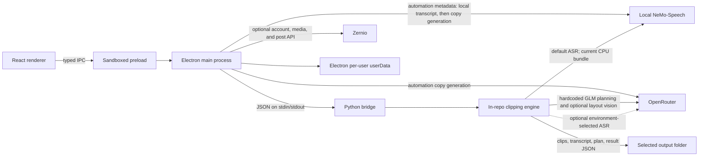

# Architecture and data flow

This document describes the **current verified state** unless a section is explicitly labeled **Owner decision** or **Planned / not yet implemented**. See [Project status](PROJECT_STATUS.md) for the evidence ledger.

## Current verified state

The renderer is sandboxed, context-isolated, and has no Node integration. The preload exposes a narrow typed API. Main validates IPC input, owns process launch and cancellation, and authorizes local media. The Python bridge runs the in-repo engine and treats saved run files and provider responses as untrusted input.

Current transcription uses `nvidia/nemotron-3.5-asr-streaming-0.6b` by default. The bundled NeMo runtime is present but CPU-only; no device is selected by the current application path, and GPU completion is not claimed. The engine also retains an OpenRouter audio-transcription implementation selected by `TRANSCRIPTION_BACKEND=openrouter`. It is not exposed as a provider choice in the current UI, sends audio to OpenRouter when selected, and can incur charges.

Current planner and optional layout-vision behavior are hardcoded to `z-ai/glm-5.3-flash` through OpenRouter. The bridge requires an OpenRouter key. Codex, selectable providers/models, and model discovery are absent. ElevenLabs is not a current provider.

OpenRouter and Zernio keys are currently encrypted with Electron `safeStorage` in the per-user `settings.json`; only configured-state booleans reach the renderer. The key is passed to the clipping process for current OpenRouter calls. No Codex login or Windows-Keyring-backed Codex session exists yet.

Current local state remains under Electron `app.getPath('userData')`, including settings, logs, thumbnails, work directories, automation data, account caches, and posting history. Rendered media and run artifacts remain in the selected output folder. This is not a portable project-local data layout.

The canonical source launcher resolves project-local Python, Node/Electron, FFmpeg/ffprobe, yt-dlp, NeMo-Speech, and the existing model. Packaging configuration contains macOS and Windows targets, but GPU-complete resources, portable state, deterministic staging, and release qualification are not complete.

## Owner decisions

- Introduce one versioned contract for `local-nemo`, `openrouter`, and `codex`, with validated model IDs and ASR/LLM roles.
- Keep local ASR separate from remote LLM planning. CPU execution remains diagnostic; CUDA or Vulkan GPU evidence is mandatory.
- Run the official Codex app server from main. The renderer receives safe status and model metadata only.
- Keep reusable credentials in main-process/Windows Keyring ownership. Never write raw Codex tokens, cookies, or `auth.json` to renderer state, logs, argv, Git, fixtures, or portable data.
- Move non-secret application state to a versioned project-local `data\` root selected before stores initialize.

## Planned / not yet implemented

- Typed provider/model/device selection and explicit, non-generative discovery.
- Official Codex/ChatGPT-plan login, account status, logout, and model inventory.
- GPU NeMo execution with a real local fixture and word timestamps.
- Project-local portable data, migration, drafts, recent projects, crash recovery, and non-destructive history clearing.
- Updated resource staging, packaging validation, public manifest, and third-party notices.

Operational details are in [Portable Windows](PORTABLE_WINDOWS.md), [Providers](PROVIDERS.md), and [Transcription](transcription.md).
